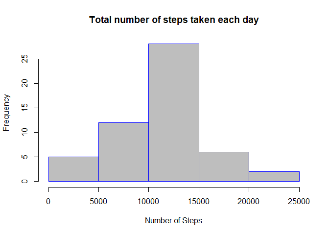
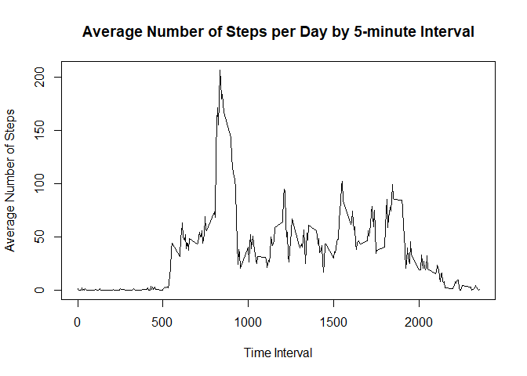
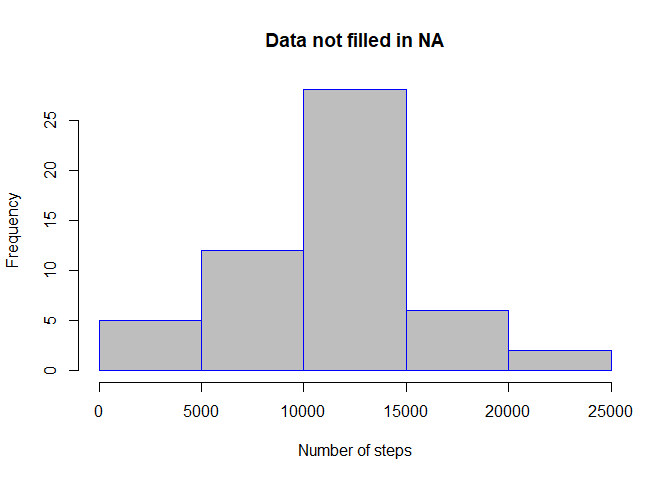
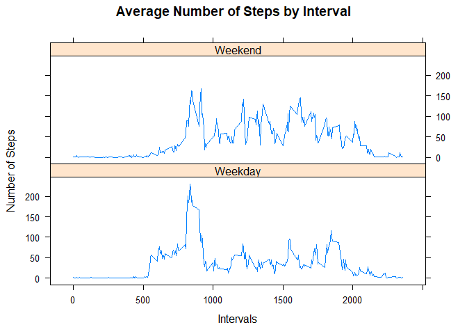

### Topic: Analyzing Data From A Personal Activity Monitoring Device

### Introduction
It is now possible to collect a large amount of data about personal movement using activity monitoring devices such as a Fitbit, Nike Fuelband, or Jawbone Up. These type of devices are part of the “quantified self” movement – a group of enthusiasts who take measurements about themselves regularly to improve their health, to find patterns in their behavior, or because they are tech geeks. But these data remain under-utilized both because the raw data are hard to obtain and there is a lack of statistical methods and software for processing and interpreting the data.

This analysis makes use of data from a personal activity monitoring device. This device collects data at 5 minute intervals through out the day. The data consists of two months of data from an anonymous individual collected during the months of October and November, 2012 and include the number of steps taken in 5 minute intervals each day.

The data for this assignment can be downloaded from the course web site: [Activity monitoring data][1] [52K].

[1]: https://d396qusza40orc.cloudfront.net/repdata%2Fdata%2Factivity.zip

### Downloading the Datasets

```r
setwd("C:/Users/happy/Desktop/R Project/RepData_PeerAssessment1/")

library(lattice)
url <- "https://d396qusza40orc.cloudfront.net/repdata%2Fdata%2Factivity.zip"
download.file(url, destfile = "C:/Users/happy/Desktop/R Project/RepData_PeerAssessment1/repdata_data_activity.zip")
unzip("repdata_data_activity.zip", files = "activity.csv")      # unzip the datafie
```

## Loading and preprocessing the data

```r
activity <- read.csv("C:/Users/happy/Desktop/R Project/RepData_PeerAssessment1/activity.csv", sep=',', header=TRUE)  ## Loading Dataset
names(activity)   ## Column name of the Dataset
```

```
## [1] "steps"    "date"     "interval"
```

```r
dim(activity)   ## Dimension of the Dataset
```

```
## [1] 17568     3
```

```r
length(activity)  ## Length of the Dataset
```

```
## [1] 3
```

```r
str(activity)   ## Structure of the Dataset
```

```
## 'data.frame':	17568 obs. of  3 variables:
##  $ steps   : int  NA NA NA NA NA NA NA NA NA NA ...
##  $ date    : chr  "2012-10-01" "2012-10-01" "2012-10-01" "2012-10-01" ...
##  $ interval: int  0 5 10 15 20 25 30 35 40 45 ...
```

```r
head(activity)  ## Head with 6 Rows of Dataset
```

```
##   steps       date interval
## 1    NA 2012-10-01        0
## 2    NA 2012-10-01        5
## 3    NA 2012-10-01       10
## 4    NA 2012-10-01       15
## 5    NA 2012-10-01       20
## 6    NA 2012-10-01       25
```

```r
tail(activity)  ## Last 6 rows of the Dataset
```

```
##       steps       date interval
## 17563    NA 2012-11-30     2330
## 17564    NA 2012-11-30     2335
## 17565    NA 2012-11-30     2340
## 17566    NA 2012-11-30     2345
## 17567    NA 2012-11-30     2350
## 17568    NA 2012-11-30     2355
```

### Calculate the total number of steps taken per day
#### To calculate the total number of steps taken per day, I ignore the missing values in the dataset.


```r
total_steps <- aggregate(steps ~ date, activity, sum)
```
#### Below is the histogram of the total number of steps taken each day


```r
hist(total_steps$steps, xlab="Number of Steps", ylab="Frequency",col="grey",border="blue", main="Total number of steps taken each day")
```

<!-- -->

#### Calculate and report the mean and median of the total number of steps taken per day.

```r
stepmean <- mean(total_steps$steps, na.rm=TRUE)    ## Mean of the total steps
stepmedian <- median(total_steps$steps, na.rm=TRUE)   ## Median of the total steps
```
The mean of total number of steps taken per day is: 

```
## [1] 10766.19
```
The median of total number of steps taken per day is: 

```
## [1] 10765
```
### For the average daily activity pattern I have made a time series plot of the 5-minute interval (x-axis) and the average number of steps taken across all days (y-axis).

```r
steps_interval <- aggregate(steps ~ interval, activity, mean)
plot(steps_interval$interval,steps_interval$steps, type="l", xlab="Time Interval", ylab="Average Number of Steps",main="Average Number of Steps per Day by 5-minute Interval")
```

<!-- -->

#### The 5-minute interval on average across all the days in the dataset that contains the maximum number of steps are shown below.

```r
max_interval <- steps_interval[which.max(steps_interval$steps),1]
cat('The maximum number of steps occurs at', substring(toString(max_interval),1, 1),':', substring(toString(max_interval),2, 3),'AM')
```

```
## The maximum number of steps occurs at 8 : 35 AM
```
### Imputing missing values: It is noted that number of days/intervals have missing values. The presence of missing values may introduce bias into some calculations or summaries of the data. I Calculate and report the total number of missing values in the dataset (i.e. the total number of rows with missing values)

```r
na_number <- sum(is.na(activity[,1]))
cat('The total number of missing values is:', toString(na_number))
```

```
## The total number of missing values is: 2304
```
#### I assigned the interval mean to filling the missing values for creating a new dataset.

```r
averageS <- aggregate(steps ~ interval, data = activity, FUN = mean)
nafill <- numeric()
for (i in 1:nrow(activity)) {
    temp <- activity[i, ]
    if (is.na(temp$steps)) {
        steps <- subset(averageS, interval == temp$interval)$steps
    } else {
        steps <- temp$steps
    }
    nafill <- c(nafill, steps)
}
```
#### Now I create a new dataset that is equal to the original dataset but with the missing data filled in.

```r
new_activity <- activity
new_activity$steps <- nafill
```
#### I have made two histograms of the total number of steps taken each day for both missing and no missing values. 

```r
StepsTotal <- aggregate(steps ~ date, data = new_activity, sum, na.rm = TRUE)

hist(StepsTotal$steps, xlab="Number of steps",ylab="Frequency", 
     main="Data filled in NA",border='grey',col="blue")
```

<!-- -->

```r
hist(total_steps$steps, xlab="Number of steps",ylab="Frequency",
     main="Data not filled in NA",border='blue',col="gray",)
```

<!-- -->

#### I calculate the mean and median of the new dataset.

```r
step_mean   <- mean(StepsTotal$steps);
step_median <- median(StepsTotal$steps);
cat('The new mean is:', toString(step_mean))
```

```
## The new mean is: 10766.1886792453
```

```r
cat('The new median is:', toString(step_median))
```

```
## The new median is: 10766.1886792453
```
##### These values differ from the estimates from the first part of the assignment. The difference from the previous data are given below:

```r
meandiff <- step_mean - stepmean
mediandiff <- step_median - stepmedian
cat('The different in mean is:', toString(meandiff))
```

```
## The different in mean is: 0
```

```r
cat('The different in median is:', toString(mediandiff))
```

```
## The different in median is: 1.1886792452824
```
##### The mean is the same however the median does have a small difference. It is observed that the impact of NA has the most effect on the 10000 - 150000 step interval.

### The differences in activity patterns between weekdays and weekends start with creating a new factor variable in the dataset with two levels – “weekday” and “weekend” indicating whether a given date is a weekday or weekend day. The dataset with the filled-in missing values is used for this part.


```r
weekdays <- c("Monday", "Tuesday", "Wednesday", "Thursday", "Friday")
new_activity$dow = as.factor(ifelse(is.element(weekdays(as.Date(new_activity$date)),weekdays), "Weekday", "Weekend"))
StepsU <- aggregate(steps ~ interval + dow, new_activity, mean)
```
#### Below is the panel plot containing a time series plot of the 5-minute interval (x-axis) and the average number of steps taken, averaged across all weekday days or weekend days (y-axis).

```r
xyplot(StepsU$steps ~ StepsU$interval|StepsU$dow, main="Average Number of Steps by Interval",xlab="Intervals", ylab="Number of Steps",layout=c(1,2), type="l")
```

<!-- -->

## The End of the Report
